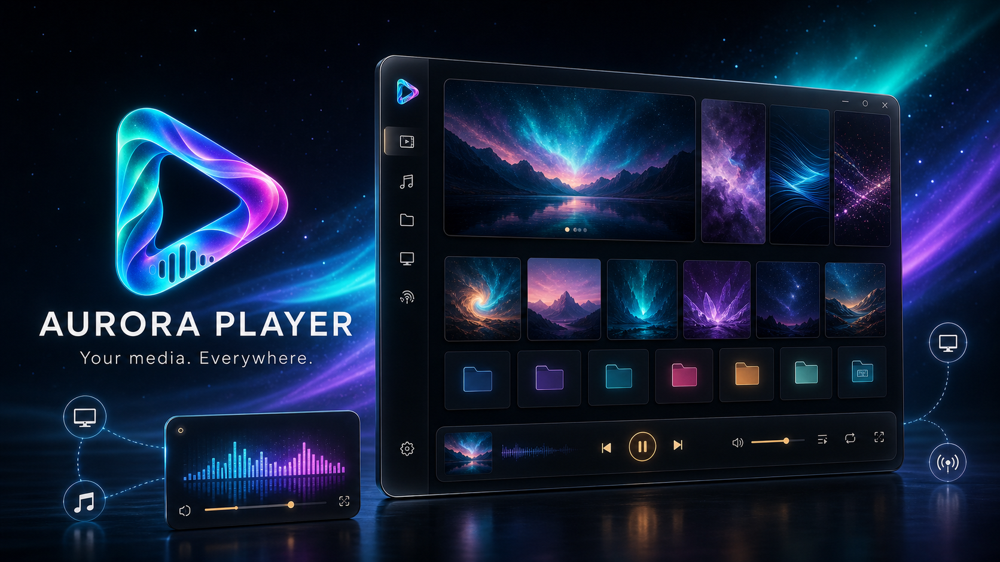

# Aurora Player

Aurora Player 是一款基于 Electron、React 和 libmpv 的桌面媒体播放器，用于统一浏览和播放本地媒体与网络媒体。



## 功能简介

- 播放视频、音频和图片，支持播放进度记忆、章节、字幕与多轨道。
- 管理本地媒体库、合集、播放列表和最近播放记录。
- 浏览 HTTP/HTTPS、WebDAV、SMB、FTP/FTPS、SFTP 网络媒体。
- 支持网络文件与目录下载、暂停继续、多线程和限速。
- 读取媒体标签及同目录 NFO，并可从配置的来源获取视频信息。
- 安装包内置 FFmpeg/FFprobe，用于媒体探测和封面截取，不要求系统额外安装。
- 提供主题、字号、中英文、通知中心和性能 HUD 等界面设置。

## 快速开始

运行环境需要 Node.js 20 以上版本。视频播放依赖与当前平台、架构匹配的 libmpv SDK；首次安装前请先阅读 [libmpv 部署说明](docs/libmpv-runtime.md)。

```powershell
npm install
npm run dev
```

常用命令：

```powershell
npm run typecheck  # TypeScript 类型检查
npm run build      # 构建应用
npm run dist       # 生成安装包
```

## libmpv 环境配置与原生模块构建

Aurora Player 通过 `electron-mpv-video` 的原生 Node 插件调用 libmpv。开发环境必须同时具备 libmpv 头文件、链接库和运行库，并把原生插件编译为与当前 Electron、平台和 CPU 架构匹配的版本。

原生播放环境由以下文件组成：

```text
mpv_addon.node       electron-mpv-video 原生插件
libmpv-2.dll         Windows libmpv 运行库，部分构建名为 mpv-2.dll
其他依赖 DLL         当前 libmpv 构建附带的运行库
```

构建完成后，这些文件位于：

```text
node_modules/electron-mpv-video/native/mpv-addon/build/Release/
```

当前项目仅支持 Windows x64。其他桌面平台没有维护可用的原生构建和发布流程。

### Windows x64 前置环境

安装以下工具：

- Node.js 20 或更高版本，推荐 Node.js 22。
- Python 3，供 node-gyp 使用。
- Visual Studio 2022/2026 或 Visual Studio Build Tools。
- Visual Studio 的“使用 C++ 的桌面开发”工作负载。
- MSVC x64/x86 工具集以及 Windows 10/11 SDK。

可在 Visual Studio 的 x64 Native Tools Command Prompt 中检查工具：

```powershell
where.exe cl
where.exe link
where.exe dumpbin
node --version
npm --version
python --version
```

项目的 `scripts/patch-node-gyp-vs2026.mjs` 会给依赖内置的 node-gyp 增加 Visual Studio 2026 与 v145 工具集识别。若存在 `.tools/python-3.13/python.exe`，`scripts/rebuild-mpv.mjs` 会优先使用这份项目内 Python，避免误用 Windows Store 的 Python 启动器。

### 准备 Windows libmpv SDK

准备与 Windows x64 匹配的 libmpv 开发包，至少需要：

- `mpv/client.h`
- `mpv/render.h`
- `mpv/render_gl.h`
- `mpv.lib`
- `libmpv-2.dll` 或 `mpv-2.dll`
- 该 libmpv 构建依赖的其他 DLL

不设置自定义路径时，项目默认读取：

```text
%USERPROFILE%\libmpv\
├─ include\
│  └─ mpv\
│     ├─ client.h
│     ├─ render.h
│     └─ render_gl.h
├─ lib\
│  └─ mpv.lib
└─ bin\
   ├─ libmpv-2.dll
   └─ 其他依赖 DLL
```

头文件、`mpv.lib`、DLL、Electron 和 Node 原生插件必须使用相同平台与架构；不要混用不同架构或不同 SDK 版本的文件。

### 自定义 SDK 路径

必须在执行 `npm install`、`npm ci` 或 `npm run mpv:rebuild` 的同一个终端中设置：

```powershell
$env:MPV_INCLUDE_DIR = 'D:\sdk\libmpv\include'
$env:MPV_LIB = 'D:\sdk\libmpv\lib\mpv.lib'
$env:MPV_RUNTIME_DIR = 'D:\sdk\libmpv\bin'
```

| 变量 | 内容 |
| --- | --- |
| `MPV_INCLUDE_DIR` | 头文件根目录；其下必须存在 `mpv/client.h`、`mpv/render.h` 和 `mpv/render_gl.h`。 |
| `MPV_LIB` | Windows `mpv.lib` 的完整路径。 |
| `MPV_RUNTIME_DIR` | libmpv 动态库及全部配套运行库所在目录。构建脚本会把运行库复制到原生插件旁。 |
| `MPV_HWDEC` | 可选的运行时硬件解码覆盖值；未设置时使用项目默认值。修改后必须完全重启应用。 |

环境变量只在当前终端会话有效。重新打开 PowerShell 后需要重新设置，或者将其写入开发机的用户环境变量。

### 开发包没有 mpv.lib

部分 Windows 开发包只提供 MinGW 使用的 `libmpv.dll.a`，而本项目使用 MSVC，需要 `mpv.lib`。可按以下顺序生成：

```powershell
# 只展开 npm 依赖，不执行 postinstall 和原生编译
npm install --ignore-scripts

# 在 Visual Studio x64 Native Tools Command Prompt 中执行
powershell -ExecutionPolicy Bypass `
  -File .\node_modules\electron-mpv-video\scripts\create-libmpv-import-lib.ps1

# 生成 mpv.lib 后执行完整安装
npm install
```

如果 SDK 不在默认位置，应先设置 `MPV_LIB` 和 `MPV_RUNTIME_DIR`。辅助脚本使用 `dumpbin.exe` 读取 DLL 导出表，再使用 `lib.exe` 生成 MSVC 导入库。

### npm 安装与启动命令

首次安装推荐：

```powershell
npm install
npm run dev
```

CI 或要求严格按照 lockfile 安装时使用：

```powershell
npm ci
npm run dev
```

相关命令：

| 命令 | 作用 |
| --- | --- |
| `npm install --ignore-scripts` | 只安装依赖文件，不应用补丁、不编译 mpv 原生插件；主要用于准备 `mpv.lib` 或排查安装问题。 |
| `npm install` | 安装依赖，并通过根项目 `postinstall` 自动应用补丁和重建 mpv 原生模块。 |
| `npm ci` | 按 lockfile 进行干净安装，同样会执行 `postinstall`。 |
| `npm run mpv:rebuild` | 重新识别 VS/Python、编译 `mpv_addon.node` 并复制 libmpv 运行库。 |
| `npm rebuild electron-mpv-video` | 直接运行依赖的安装脚本；不会先执行项目的 VS 2026 兼容脚本，因此日常应优先使用 `npm run mpv:rebuild`。 |
| `npm run dev` | 启动开发环境。运行前必须已经成功生成原生插件和运行库。 |
| `npm run build` | 构建主进程和渲染进程代码，不重新编译 libmpv。 |
| `npm run dist` | 构建并生成 Windows x64 安装包。打包前应先确认 mpv 原生模块已正确构建。 |
| `npm run version:check` | 校验 `package.json` 与 lockfile 中的版本号一致。构建时会自动执行。 |
| `npm run version:set -- 1.1.0` | 将项目唯一版本号更新为指定的语义化版本，并同步 lockfile。 |

### 版本与发布标记

`package.json` 的 `version` 是 Aurora Player 唯一的版本来源；Electron、安装包和“关于”页面都会读取该值，不在源码中维护第二份版本常量。准备发布新版本时执行：

```powershell
npm run version:set -- 1.1.0
npm run typecheck
npm run dist
git add package.json package-lock.json
git commit -m "release: v1.1.0"
git tag v1.1.0
git push origin HEAD --follow-tags
```

GitHub Release 的标签应与 `package.json` 保持一致，并使用 `v<版本号>`，例如 `v1.1.0`。应用检查更新时会兼容带或不带 `v` 前缀的标签。

### patch-package 补丁流程

根项目的 `postinstall` 为：

```text
patch-package && npm run mpv:rebuild
```

完整执行顺序如下：

```text
npm install / npm ci
└─ postinstall
   ├─ patch-package
   │  └─ 应用 patches/electron-mpv-video+0.1.1.patch
   └─ npm run mpv:rebuild
      ├─ scripts/patch-node-gyp-vs2026.mjs
      └─ scripts/rebuild-mpv.mjs
         └─ npm rebuild electron-mpv-video
            ├─ 校验 libmpv SDK
            ├─ node-gyp 编译 mpv_addon.node
            └─ 复制 libmpv 及其依赖运行库
```

当前补丁文件为：

```text
patches/electron-mpv-video+0.1.1.patch
```

它用于补充项目需要但上游 `electron-mpv-video@0.1.1` 尚未提供的接口和原生行为。安装依赖时不要跳过 `patch-package`，否则 JS、Preload、IPC 和原生插件的接口可能不一致。

手动重新应用现有补丁：

```powershell
npx patch-package
npm run mpv:rebuild
```

修改依赖并重新生成补丁时，只应修改 `dist/` 中必须随包运行的文件和 `native/mpv-addon/src/` 原生源码，不要把 `native/mpv-addon/build/` 下的 `.node`、DLL、PDB、OBJ、VCXPROJ 或本机绝对路径写进补丁：

```powershell
# 从未执行脚本的依赖状态开始，避免先产生原生构建文件
npm install --ignore-scripts

# 完成对 node_modules/electron-mpv-video 的必要源码修改后生成补丁
npx patch-package electron-mpv-video --exclude "native/mpv-addon/build/.*"

# 应用项目兼容脚本并重新编译原生模块
npm run mpv:rebuild
```

更新 `electron-mpv-video` 版本后，补丁文件名和上下文也会改变。应重新生成补丁并检查其中没有二进制文件、构建目录和开发机绝对路径，再执行一次完整安装流程。

### 何时必须重新编译

出现以下任一变化时执行 `npm run mpv:rebuild`：

- Electron 或 Node 原生 ABI 变化。
- 更新 `electron-mpv-video`。
- 修改 `native/mpv-addon/src/` 或项目补丁。
- 更换 libmpv SDK、CPU 架构、Visual Studio、MSVC 工具集或 Windows SDK。
- 修改 `MPV_INCLUDE_DIR`、`MPV_LIB` 或 `MPV_RUNTIME_DIR`。
- `mpv_addon.node`、libmpv DLL 丢失或被其他安装流程覆盖。

仅修改 React、CSS、普通 TypeScript 业务代码时不需要重新编译 libmpv。

### 检查构建产物

Windows 开发环境执行：

```powershell
$mpvRuntime = 'node_modules\electron-mpv-video\native\mpv-addon\build\Release'
Get-ChildItem -LiteralPath $mpvRuntime
```

至少应存在：

```text
mpv_addon.node
libmpv-2.dll  或 mpv-2.dll
```

如果 libmpv 依赖其他 DLL，它们也必须位于同一目录。发布应用不能依赖开发机 `%USERPROFILE%\libmpv` 或系统 `PATH` 中的运行库。

### 安装包中的 libmpv

`electron-builder.json` 设置了 `npmRebuild: false`，因为 mpv 插件已经在 `postinstall` 中按当前环境编译；打包阶段重复 rebuild 可能覆盖正确产物或触发无关可选原生依赖。`mpv_addon.node` 和 `libmpv-2.dll` 通过 `asarUnpack` 保留在 `app.asar` 外部。

打包命令：

```powershell
npm run dist
```

Windows 解包应用中的目标位置：

```text
release\win-unpacked\resources\app.asar.unpacked\node_modules\
  electron-mpv-video\native\mpv-addon\build\Release\
  ├─ mpv_addon.node
  ├─ libmpv-2.dll
  └─ 其他依赖 DLL
```

发布前检查：

```powershell
Get-ChildItem -LiteralPath `
  'release\win-unpacked\resources\app.asar.unpacked\node_modules\electron-mpv-video\native\mpv-addon\build\Release'
```

### 常见错误

`Could not find any Visual Studio installation to use`：没有安装 C++ 工作负载、MSVC 或 Windows SDK，或者使用 VS 2026 时没有经过项目兼容脚本。安装工具后执行 `npm run mpv:rebuild`。

`libmpv headers, import library or runtime DLL not found`：检查三个 `MPV_*` 路径是否在当前终端设置；`MPV_INCLUDE_DIR` 应指向 `include`，不是 `include/mpv`。

`The specified module could not be found`：不一定是 `.node` 文件不存在，更常见的是插件旁缺少 libmpv 或其间接依赖 DLL。可用 `dumpbin /dependents libmpv-2.dll` 检查依赖。

`%1 is not a valid Win32 application`：Electron、`mpv_addon.node` 或 libmpv DLL 的架构不一致，例如 x64 应用加载了 x86 DLL。

`NODE_MODULE_VERSION` 不匹配：原生插件是为其他 Node/Electron ABI 构建的，重新执行 `npm run mpv:rebuild`。

补丁无法应用：通常是 `electron-mpv-video` 版本变化、`node_modules` 已被手动修改，或补丁中误包含构建产物。恢复与 lockfile 匹配的依赖版本后重新生成最小源码补丁。

视频能播放但轨道或特性为空：轨道识别由内置 ffprobe 完成，不依赖 libmpv 配置。查看 `data/logs/aurora.log` 中的 `probe` 日志；远程文件还要求媒体源和本地流代理可访问。

更详细的平台背景和发布说明见 [libmpv 部署说明](docs/libmpv-runtime.md)。

## 项目文档

- [软件架构与 Mermaid 架构图](docs/architecture.md)
- [libmpv 开发与发布部署](docs/libmpv-runtime.md)

## 主要目录

```text
src/main       Electron 主进程、媒体库、网络协议和系统服务
src/preload    主进程与界面之间的安全桥接
src/renderer   React 页面、播放器和界面样式
src/shared     IPC 通道及共享类型
scripts        开发、构建和原生模块脚本
docs           项目说明文档
```

应用运行数据保存在程序目录下的 `data/`，包括设置、媒体库数据库、凭据、日志、下载文件和临时封面。打包结果输出到 `release/`。

安装包内的 FFmpeg/FFprobe 是独立的第三方运行时，不属于本项目 MIT 代码；分发前请同时保留并核对 `ffmpeg-static` 所附的 GPL-3.0-or-later 许可及其他第三方声明。

## 第三方商标与品牌标识

Aurora Player 会根据媒体文件的轨道元数据，以普通文字显示 Dolby Vision、Dolby Atmos、Dolby TrueHD、Dolby Digital、Dolby Digital Plus、DTS、DTS-HD 等格式或特性名称。这些文字仅用于客观描述和识别媒体流，不表示 Aurora Player 已获得相关认证，也不表示本项目与相应商标权利人存在关联、赞助或背书关系。

- Dolby、Dolby Vision、Dolby Atmos、Dolby TrueHD、Dolby Digital、Dolby Digital Plus 及相关标识是 Dolby Laboratories Licensing Corporation 在美国和/或其他国家或地区的商标。相关商标与品牌使用要求请参考 [Dolby 官方许可说明](https://professional.dolby.com/licensing/)及其最新品牌指南。
- DTS、DTS-HD 及相关标识是 DTS, Inc. 或其关联公司的商标。相关商标使用要求请参考 [DTS/Xperi 官方条款](https://dts.com/terms-conditions/)。
- 本项目默认不包含、不复制也不使用 Dolby、DTS 或其他第三方公司的 Logo。任何贡献、派生版本、发行包、官网、应用商店素材及宣传截图，未经相应权利人明确许可，不得加入第三方 Logo、认证徽章、品牌专属图形，也不得使用“官方认证”“官方支持”“合作伙伴”等可能造成关联或背书误解的表述。
- 普通文字名称仅应出现在媒体轨道信息、兼容性说明或必要的事实描述中，不应被突出用作 Aurora Player 的产品名称、图标、宣传标语或来源标识。若希望进一步降低品牌使用风险，可优先显示 AC-3、E-AC-3、E-AC-3 JOC、`dvh1`、`dvhe`、`dca` 等技术性编解码器或配置名称。
- 商标说明不等同于编解码器、专利或技术许可。商业分发、预装、宣传特定格式支持或使用任何第三方 Logo 前，发行者应自行确认适用地区的商标、专利、编解码器及认证许可要求，并在必要时取得专业法律意见或联系相应许可方。

本文中的第三方名称和链接仅用于识别权利人及说明使用边界；所有第三方商标均归其各自权利人所有。

## License

MIT
