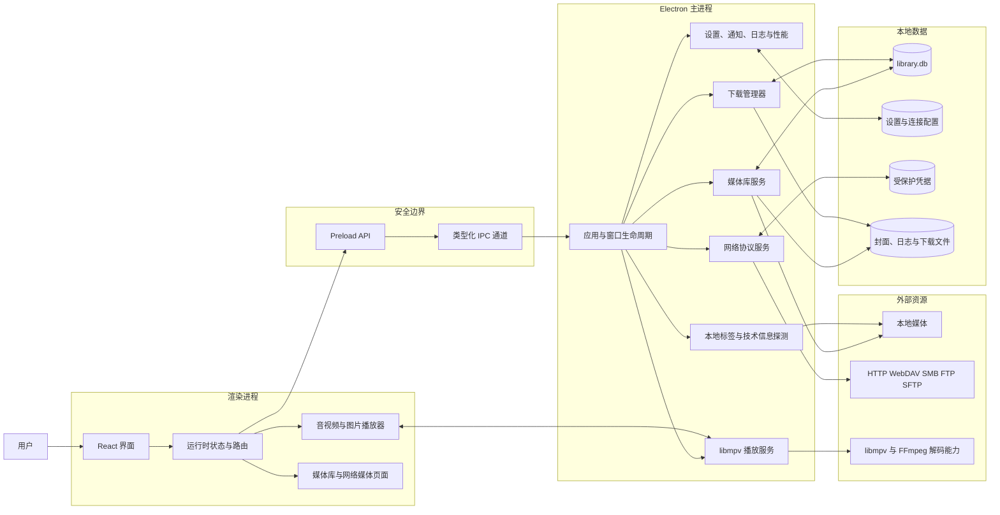

# 软件架构

Aurora Player 使用 Electron 的主进程、Preload 隔离层和 React 渲染进程组成桌面应用。播放能力由独立的 libmpv 原生模块提供，媒体库与下载状态由本地数据库持久化。

## 模块职责

| 模块 | 目录 | 职责 |
| --- | --- | --- |
| 主进程 | `src/main` | 窗口生命周期、IPC、数据库、文件系统、网络与播放服务 |
| Preload | `src/preload` | 仅向界面暴露经过约束的应用 API 和 libmpv API |
| 渲染进程 | `src/renderer` | 页面、组件、主题、用户交互和播放界面 |
| 共享层 | `src/shared` | 主进程和渲染进程共用的数据类型与 IPC 名称 |
| 播放运行时 | `electron-mpv-video` | libmpv 原生会话、共享纹理或软件渲染管线 |
| 数据层 | `data` | SQLite 数据库、配置、凭据、日志、下载与临时文件 |

## 主要数据流

1. 界面通过 Preload 暴露的 API 发起操作，不直接访问 Node.js。
2. 主进程通过 IPC 分发请求到媒体库、网络、下载、媒体探测或系统服务。
3. 视频播放由主进程中的 libmpv 服务管理，渲染进程负责显示画面和播放器 UI。
4. 媒体库、播放历史和下载任务写入 SQLite；设置与网络连接信息分别保存到配置和安全凭据文件。
